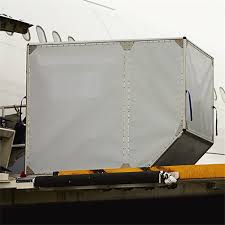
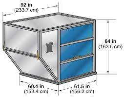
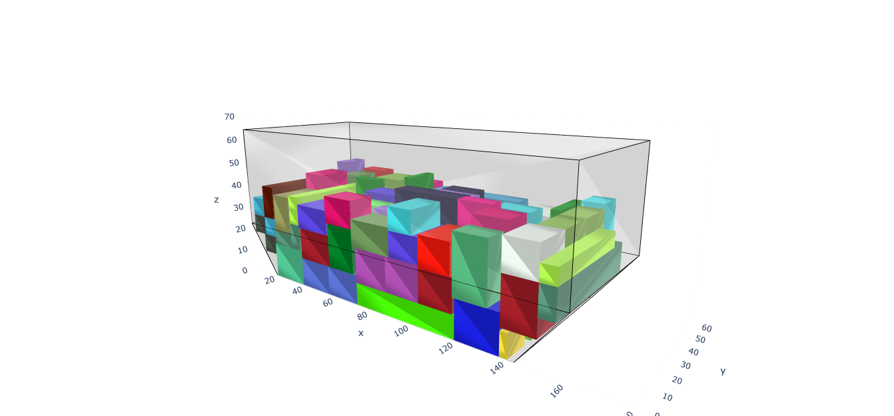
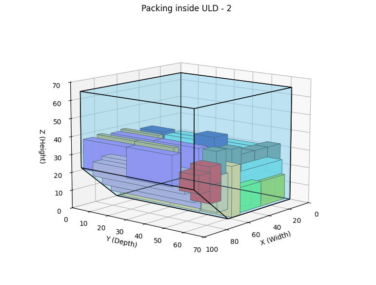

# ULD Cargo Packing Optimization System

## Overview

Efficient cargo loading is a critical problem in the aviation and logistics industries. Aircraft cargo is transported using **Unit Load Devices (ULDs)**, such as LD-1 and LD-3 containers, which have fixed dimensions and strict safety constraints. Poor packing leads to wasted space, increased operational costs, and suboptimal aircraft utilization.

This project presents a system for **visualizing and optimizing the arrangement of cargo boxes inside ULDs**. It combines classical packing heuristics with evolutionary optimization techniques to produce high-quality packing layouts while respecting real-world constraints.

Here are 2 snippets of a ULD - 

* 
* 

---

## Problem Statement

### Objective

Develop a system that:

* Maximizes volume utilization inside a ULD
* Respects packing constraints (no overlaps, valid placements)
* Provides a clear 3D visualization of the packing arrangement

### Given

* A set of boxes, each defined by:

  * Width, depth, height
  * Weight (optional constraints)
* The internal dimensions of a ULD container

### Goal

Determine an optimal placement of boxes such that:

* No boxes overlap
* All boxes lie completely within the container
* Space utilization is maximized

---

## Why This Problem Matters

Cargo packing is a variant of the **3D bin packing problem**, which is known to be NP-hard. This means:

* Exact solutions are computationally infeasible for large instances
* Heuristic and metaheuristic approaches are required

In real-world logistics:

* Even a small improvement in space utilization can lead to significant cost savings
* Airlines and cargo companies operate at massive scale, making optimization impactful
* Constraints such as weight distribution, fragility, and stability further complicate the problem

This project addresses both **theoretical complexity** and **practical applicability**.

---

## System Architecture

The system is modular and designed for extensibility.

### 1. Packing Simulator

* Simulates how boxes are placed inside the ULD
* Implements heuristic strategies such as:

  * **Bottom-Left-Back (BLB)** placement (A custom self-built greedy algorithm)
  * **Intelligent placement** (Also self coded but places in the best orientation possible considering the constraints)
* Ensures:

  * No overlap between boxes
  * Valid positioning within container bounds
  * Support constraints (no floating boxes)

### 2. Core Optimization Engine (Genetic Algorithm)

* Represents each solution as a sequence of box placements
* Evolves solutions over generations using:

  * Selection
  * Crossover
  * Mutation
* Fitness function evaluates:

  * Space utilization
  * Packing feasibility

This enables exploration beyond greedy solutions and improves packing quality over time.

### 3. Visualization

* Provides a 3D representation of the packing result
* Displays:

  * ULD as a transparent container
  * Boxes in distinct colors
* Helps in debugging, analysis, and presentation

---

## Constraints Supported

### Core Constraints

* No overlapping boxes
* All boxes must remain inside the ULD

### Optional Constraints (Extensible)

* Heavier boxes placed below lighter ones
* Fragile boxes not placed at the bottom
* Box orientation constraints (future extension)

---

## Output

The system produces:

* A 3D visualization of the packed ULD
* Utilization metrics:

  * Percentage of volume used
  * Number of boxes successfully packed
* Comparative analysis:

  * Greedy (BLB) vs Genetic Algorithm performance
 
* Here are some results of the optimization engine:

* 

* 

---

## Key Features

* Modular and extensible architecture
* Hybrid approach combining heuristics and evolutionary optimization
* Realistic constraint handling
* Interactive 3D visualization
* Scalable design for experimentation and research

---

## Why This Solution Stands Out

This project goes beyond a basic implementation of 3D packing:

* Integrates **simulation + optimization + visualization** in a single pipeline
* Uses **Genetic Algorithms** to overcome limitations of greedy heuristics
* Designed with **real-world constraints** in mind
* Provides a **visual and quantitative evaluation framework**

The result is a system that is not only technically robust but also practically useful for understanding and improving cargo packing strategies.

---

## Future Work

* Reinforcement Learning-based packing strategies (e.g., PPO)
* Advanced free-space tracking for improved placement
* Parallelized fitness evaluation for speed improvements
* Integration with real-world cargo datasets
* Multi-objective optimization (space, stability, weight balance)

---

## Conclusion

Efficient cargo packing is a complex and high-impact problem. This project demonstrates a structured and scalable approach to solving it using a combination of algorithmic techniques and practical engineering design. It serves as both a research foundation and a practical tool for exploring optimization strategies in 3D packing problems.
